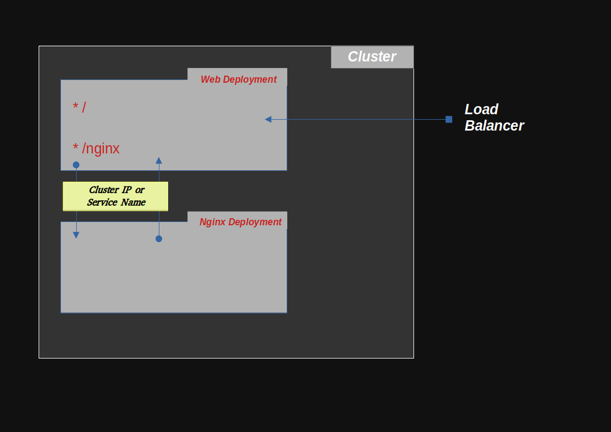

# Project 6: _Setting up communication between different Kubernetes deployments_

>For this project, I provisioned a Kubernetes cluster in my VM using minikube

## __Requirements__ :
* VirtualBox
* Minikube
* Kubectl

## Create a Minikube node using the virtualBox driver
``` sh
$ minikube  start --vm-driver=virtualbox
```

You could ssh into the node using ```ssh docker@$(minikube ip) ```

>Take note the default minikube credentials are:
> - username: docker
> - password: tcuser

---
# The Plan



---
## Step 1: Creating the Docker image
---

First copy the ```./k8s-web-to-nginx``` folder and paste in your working directory

> - The [index.mjs](./k8s-web-to-nginx/index.mjs) file contains a simple web server and 2 endpoints. The "/" enpoint responds with a greeting from the pod, and the "/nginx" endpoint displays the nginx homepage \
> - The Dockerfile contains instructions needed to build the Docker image for our small application

Next, cd into the ```./k8s-web-to-nginx``` folder and run the following command to build the docker image.

``` bash
 $ docker build . -t 4568910/k8s-web-to-nginx
``` 
>The ```-t``` flag allows us specify a tag name  for this image. I used my dockerhub repo in the format {username}/{repo_name}

Next, goto [hub.docker.com)](https://hub.docker.com) and create a repo for our image ```k8s-web-to-nginx```

The next step will be to push the image to your docker repo using:
```
$ docker push {docker_username}/k8s-web-to-nginx
```

In my case, that would be:
```
$ docker push 4568910/k8s-web-hello
```
---
## Step 2: Creating Deployments & Services
---

In order to create the deployment and services, we will make use of the yaml file found at [./k8s-web-to-nginx.yaml](./k8s-web-to-nginx.yaml)

In this K8s manifest, the service part contains...
``` yaml
apiVersion: v1
kind: Service
metadata:
  name: k8s-web-to-nginx
spec:
  type: LoadBalancer
  selector: 
    app: k8s-web-to-nginx
  ports:
  - port: 3333
    targetPort: 3000
```

>In this service part of the manifest: 
> * ```metadata``` contains the "name" of this service ```k8s-web-to-nginx``` 
> * ```spec``` describes the pod in more details
> * - ```type``` is LoadBalancer
> * - ```selector``` states _keys_ and _values_ that are to be matched by pods which intend to receive traffic from this service
> * - ```port``` states a host port to map to the ```targetPort``` (ports from the Express server container)


And the Deployment part contains:

``` yaml
---
apiVersion: apps/v1
kind: Deployment
metadata:
  name: k8s-web-to-nginx
spec:
  replicas: 4
  selector:
    matchLabels:
      app: k8s-web-to-nginx
  template:
    metadata:
      labels:
        app: k8s-web-to-nginx
    spec:
      containers:
      - name: k8s-web-to-nginx
        image: 4568910/k8s-web-to-nginx
        resources:
          limits:
            memory: "128Mi"
            cpu: "250m"
        ports:
        - containerPort: 3000
```

>In the deployment manifest:
> * ```metadata``` holds the ```name``` of htis deployment
> * ```spec``` gives more details about the deployment
> * - ```replicas``` is the number of desired pods
> * - ```selector``` is a label selector for pods. Existing ReplicaSets whose pods are selected by this will be the ones affected by this deployment. _It must match the pod template's labels._
> * - ```template``` describes the pods that will be created.
> * - - ```metadata``` can be used to organize and categorize (scope and select) objects. May match selectors of _replication controllers_ (deployments) and _services_.
> * - - ```spec``` Specification of the desired behavior of the pod.
> * - - - ```containers``` describes resources for a list of containers belonging to the pod


The manifests for nginx are similar (but the service type is Cluster IP). Find and download it from **[nginx.yaml](./nginx.yaml)** 

---
## Step 3: Apply the yaml files to the cluster to begin initiate the creation of the resources
---

To apply the manifests, run:

``` bash
$ kubectl apply -f k8s-web-to-nginx.yaml -f nginx.yaml
```

# And, hurray!!! Our setup is complete

In order to view our resources, run:
``` bash
# to see our pods
$ kubectl get pods

# to see our service
$ kubectl get svc

# to see our deployments
$ kubectl get deploy
```

To visit the pages being served by our web server, if you're using minikube, run:
``` sh
$ minikube service k8s-web-to-nginx
```

It will open a page in your web browser with a greeting from our pod (showing that our "/" endpoint was hit).

To go to our nginx endpoint, simply add "/nginx" in front of the address on the browser page. You should be redirected to the Nginx home page. 

If this is what you get, it means everything works fine.

Here's a diagram showing the communication between both deployments:


---
## Step 4: Cleaning Up
---

To remove deployments and services, run:

``` sh
$ kubectl delete -f k8s-web-to-nginx.yaml -f nginx.yaml
```

And to stop minikube node, run:
``` sh
$ minikube stop
```